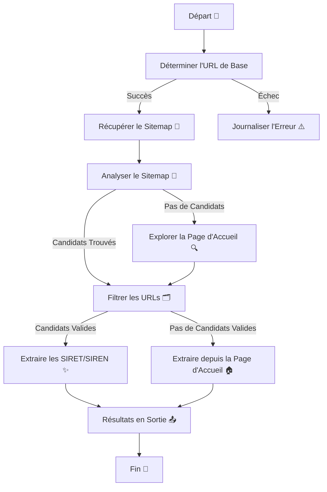

# Vigilantia Extracteur de SIRET

 🌐
 📜
 🤝

Un modeste script Python pour extraire des numéros SIRET ou SIREN directement depuis les sites web des entreprises. 🚀  
Conçu par **Vigilantia**, cet outil vise à simplifier les vérifications de conformité et les validations d'entreprise. 🛠️  
Avec la version **1.2**, nous avons amélioré la précision de la détection et ajouté la prise en charge des technologies web modernes. 🌟  
Visitez notre [site](https://www.vigilantia.fr) nous sommes fièrement basés à Metz 🇫🇷

---

## Table des Matières 📖

- [Fonctionnalités](#fonctionnalités)
- [Prérequis](#prérequis)
- [Installation](#installation)
- [Utilisation](#utilisation)
- [Logique Détaillée](#logique-détaillée)
- [Exemple de Flux de Travail](#exemple-de-flux-de-travail)
- [Processus de Développement](#processus-de-développement)
- [FAQ](#faq)
- [Contribuer](#contribuer)
- [Licence](#licence)

---

## Fonctionnalités 🌟

- **Détection Avancée :**
  - Identification précise des pages légales (ex. "Mentions légales", "CGU").
  - Reconnaissance intelligente des chemins localisés (`/fr/terms`, `/mentions-legales`).  

- **Exploration Optimisée :**
  - Exploration priorisée : détection des URLs pertinentes dans le sitemap ou le footer.
  - Gestion des sites modernes utilisant des frameworks JavaScript (Nuxt.js, React).

- **Extraction de Données :**
  - Numéros SIRET/SIREN et emails, même dans des formats complexes ou obfusqués.
  - Association logique entre les identifiants et les entreprises détectées.

- **Technologies Modernes :**
  - Support des sites avec contenu dynamique grâce à Selenium.
  - Exploration contextuelle des frames et iframes.

- **Sortie Structurée :**
  - Résultats au format CSV pour une intégration facile avec d'autres outils.

- **Open-Source :** Entièrement Open-Source et inspiré d'un repo de [Beta-Gouv](https://github.com/betagouv/signalconso-siret-extractor)  🤝. 

---

## Prérequis 🛠️

- **Python** : 3.9+
- **Bibliothèques** : 
  - `requests`
  - `beautifulsoup4`
  - `lxml`
  - `selenium`


## Installation 🔧

1. Clonez le dépôt :

```bash
git clone https://github.com/vigilantia/siret-extractor.git
cd siret-extractor
```

2. Installez les dépendances :
```bash
pip install -r requirements.txt
```

3. Tout est prêt ! 🎉

---

## Utilisation 📂

### Entrée 📥
Préparez un fichier CSV (par exemple, `input.csv`) avec une colonne nommée `domain`. Cette colonne doit lister les domaines à traiter.

**Note :** Si le fichier CSV contient des domaines malformés ou manquants, le script journalisera chaque ligne problématique et ignorera ces entrées. Assurez-vous que vos données d'entrée sont propres pour éviter les résultats manquants.

**Exemple de CSV :**

```csv
domain
example.com
business.fr
example.org
```

### Exécuter le Script ▶️

#### Avec VS Code ou Spyder :

1. Ouvrez le script (`siret_extractor.py`) dans votre IDE préféré.

**Note :** Si vous rencontrez des problèmes tels que des dépendances manquantes, assurez-vous d'avoir installé toutes les bibliothèques requises en exécutant :

```bash
pip install -r requirements.txt
```

Vérifiez également que l'interpréteur Python est correctement configuré dans les paramètres de votre IDE.

2. Insérez dans le dossier votre fichier .csv avec les domaines correctement formatés  :

```python
input_file = "input.csv"
output_file = "output.csv"
```

3. Exécutez le script. 🏃‍♂️
4. Vérifiez le fichier `output.csv` pour les résultats. 📊

#### Directement dans le Terminal :

Exécutez le script comme suit :

```bash
python siret_extractor.py input.csv output.csv
```

### Sortie 📤
Les résultats seront stockés dans `output.csv` avec la structure suivante :

```csv
domain,result
example.com,12345678901234
business.fr,None
example.org,98765432109876
```

---

## Logique Détaillée 🧠

Le script suit une approche pas à pas :

1. **Traitement de l'URL de Base :**
   - Correction automatique des URLs mal formées.
   - Tentatives sur plusieurs variantes (`https://`, `http://`, `www.`).

2. **Récupération du Sitemap :**
   - Analyse du fichier `robots.txt` pour localiser le sitemap.
   - Si absent, tente d’accéder directement à `domain.com/sitemap.xml`.

3. **Exploration des Pages Internes :**
   - Exploration intelligente des liens internes, avec priorité donnée aux footers.

4. **Extraction des Identifiants :**
   - Utilisation de regex avancés pour capturer les numéros et emails.

5. **Gestion des Erreurs :**
   - Journalisation des erreurs (par ex. domaine invalide, contenu inaccessible).

---

## Exemple de Flux de Travail 🔄

1. Saisissez les domaines dans `input.csv`. 📋
2. Exécutez le script. 🛠️
3. Validez les résultats dans `output.csv`. ✅

---


## **Optimisations et Sécurité** 🔐 ( à venir ... ) 

### **Optimisations :**
- **Crawling Efficace :**
  - Filtrage par mots-clés pour prioriser les pages pertinentes.
  - Réduction du temps d’exploration avec des limites configurables.

- **Gestion des Erreurs :**
  - Log détaillé des échecs (connexion, URL introuvable).
  - Mécanismes de reprise pour éviter les interruptions.

### **Sécurité :**
- Rotation de l’agent utilisateur pour éviter les blocages.
- Gestion des proxies pour préserver l’anonymat.

---


## Processus de Développement 🛠️

### Diagramme UML de la Logique



---

## FAQ ❓

**Q : Qu'est-ce qu'un SIRET/SIREN ?**  
A : Le SIREN (9 chiffres) et le SIRET (14 chiffres) sont des identifiants uniques pour les entreprises en France. 🇫🇷

**Q : Comment le script gère-t-il les erreurs ?**  
A : Les erreurs telles que les problèmes de connexion ou les domaines invalides sont journalisées et ignorées sans interrompre l'exécution. 🛡️

**Q : Puis-je utiliser ce script pour des sites non français ?**  
A : Le script est optimisé pour les identifiants légaux français, mais peut être adapté à d'autres motifs. 🌍

**Q : Le script peut-il fonctionner sur des sites non français ?**
A : Oui, mais les modèles de détection sont optimisés pour les entreprises françaises.

**Q : Puis-je modifier les paramètres d’exploration ?**
A : Oui, les variables comme `MAX_DEPTH` et `TIMEOUT` sont configurables.

---

## Contribuer 🤝

Nous accueillons les contributions ! 🎉 Veuillez forker le dépôt, apporter vos modifications et soumettre une pull request. 🛠️

---

## Licence 📜

Ce projet est sous licence MIT. Consultez le fichier LICENSE pour plus de détails.

**Vigilantia** – Développé à Metz avec passion. 🇫🇷
