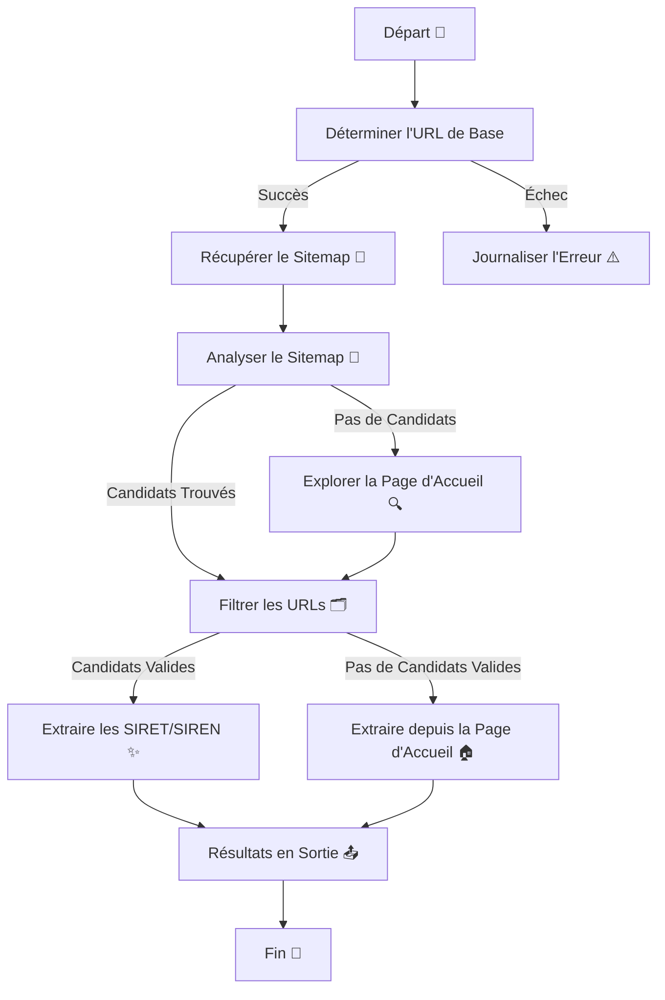

# Vigilantia Extracteur de SIRET

 🌐
 📜
 🤝

Un modeste script Python pour extraire des numéros SIRET ou SIREN directement depuis les sites web des entreprises. 🚀  
Conçu par **Vigilantia**, cet outil vise à simplifier les vérifications de conformité et les validations d'entreprise. 🛠️  
Le script explore intelligemment les sites web, examine les sitemaps et identifie les pages pertinentes pour extraire les identifiants légaux dans un format structuré.📂  
Visitez notre [site](https://www.vigilantia.fr) nous sommes fièrement basés à Metz 🇫🇷

---

## Table des Matières 📖

- [Fonctionnalités](#fonctionnalités)
- [Prérequis](#prérequis)
- [Installation](#installation)
- [Utilisation](#utilisation)
- [Logique Détaillée](#logique-détaillée)
- [Exemple de Flux de Travail](#exemple-de-flux-de-travail)
- [Processus de Développement](#processus-de-développement)
- [FAQ](#faq)
- [Contribuer](#contribuer)
- [Licence](#licence)

---

## Fonctionnalités 🌟

- **Crawling Intelligent :** Extrait les numéros SIRET/SIREN en utilisant les sitemaps et les explorations internes. 🤖
- **Identification Basée sur Regex :** Utilise des motifs pour localiser et valider avec précision les identifiants. 🔍
- **Correspondance par Mot-Clé :** Filtre les URLs de manière intelligente en fonction de termes légaux prédéfinis. 📚
- **Entrée et Sortie CSV :** Gère facilement des domaines en vrac avec une entrée/sortie au format CSV. 📑
- **Convivial pour les Débutants :** Entièrement documenté avec des exemples pour une utilisation dans Spyder et VS Code. 🧑‍💻
- **Open-Source :** Entièrement Open-Source et inspiré d'un repo de [Beta-Gouv](https://github.com/betagouv/signalconso-siret-extractor)  🤝. 


---

## Prérequis 🛠️

- **Python** : 3.9+
- **Bibliothèques** : 
  - `requests`
  - `lxml`
  - `csv`
  - `unicodedata`
  - `logging`


## Installation 🔧

1. Clonez le dépôt :

```bash
git clone https://github.com/vigilantia/siret-extractor.git
cd siret-extractor
```

2. Tout est prêt ! 🎉

---

## Utilisation 📂

### Entrée 📥
Préparez un fichier CSV (par exemple, `input.csv`) avec une colonne nommée `domain`. Cette colonne doit lister les domaines à traiter.

**Note :** Si le fichier CSV contient des domaines malformés ou manquants, le script journalisera chaque ligne problématique et ignorera ces entrées. Assurez-vous que vos données d'entrée sont propres pour éviter les résultats manquants.

**Exemple de CSV :**

```csv
domain
example.com
business.fr
example.org
```

### Exécuter le Script ▶️

#### Avec VS Code ou Spyder :

1. Ouvrez le script (`siret_extractor.py`) dans votre IDE préféré.

**Note :** Si vous rencontrez des problèmes tels que des dépendances manquantes, assurez-vous d'avoir installé toutes les bibliothèques requises en exécutant :

```bash
pip install -r requirements.txt
```

Vérifiez également que l'interpréteur Python est correctement configuré dans les paramètres de votre IDE.

2. Insérez dans le dossier votre fichier .csv avec les domaines correctement formatés  :

```python
input_file = "input.csv"
output_file = "output.csv"
```

3. Exécutez le script. 🏃‍♂️
4. Vérifiez le fichier `output.csv` pour les résultats. 📊

#### Directement dans le Terminal :

Exécutez le script comme suit :

```bash
python siret_extractor.py input.csv output.csv
```

### Sortie 📤
Les résultats seront stockés dans `output.csv` avec la structure suivante :

```csv
domain,result
example.com,12345678901234
business.fr,None
example.org,98765432109876
```

---

## Logique Détaillée 🧠

Le script suit une approche pas à pas :

1. **Déterminer l'URL de Base :** 
   - Teste les schémas courants (par exemple, `https://example.com`, `http://example.com`).
   - Tente de corriger les erreurs courantes (par exemple, `wwwexample.com` devient `www.example.com`). ✏️

2. **Récupérer le Sitemap :**
   - Vérifie le fichier `robots.txt` pour une URL de sitemap. 📜
   - Par défaut, utilise `example.com/sitemap.xml` si non spécifié. 📂

3. **Analyser le Sitemap :**
   - Extrait récursivement les URLs du sitemap et des indexes de sitemap. 🔗
   - Filtre les URLs en fonction des mots-clés (par exemple, `mentions-legales`, `privacy-policy`).

4. **Explorer les Liens Internes :**
   - Si aucun sitemap ou candidats, explore la page d'accueil pour des liens internes correspondant aux mots-clés. 🔍

5. **Extraire les SIRET/SIREN :**
   - Extrait les identifiants en utilisant des motifs regex. ✨
   - Ignore les identifiants courants ou prédéfinis (via des variables d'environnement).

---

## Exemple de Flux de Travail 🔄

1. Saisissez les domaines dans `input.csv`. 📋
2. Exécutez le script. 🛠️
3. Validez les résultats dans `output.csv`. ✅

---

## Processus de Développement 🛠️

### Diagramme UML de la Logique



---

## FAQ ❓

**Q : Qu'est-ce qu'un SIRET/SIREN ?**  
A : Le SIREN (9 chiffres) et le SIRET (14 chiffres) sont des identifiants uniques pour les entreprises en France. 🇫🇷

**Q : Comment le script gère-t-il les erreurs ?**  
A : Les erreurs telles que les problèmes de connexion ou les domaines invalides sont journalisées et ignorées sans interrompre l'exécution. 🛡️

**Q : Puis-je utiliser ce script pour des sites non français ?**  
A : Le script est optimisé pour les identifiants légaux français, mais peut être adapté à d'autres motifs. 🌍

---

## Contribuer 🤝

Nous accueillons les contributions ! 🎉 Veuillez forker le dépôt, apporter vos modifications et soumettre une pull request. 🛠️

---

## Licence 📜

Ce projet est sous licence MIT. Consultez le fichier LICENSE pour plus de détails.

